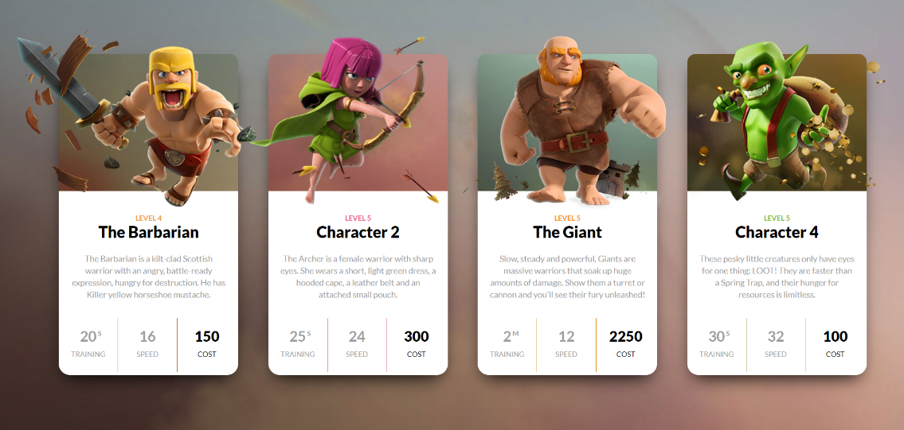
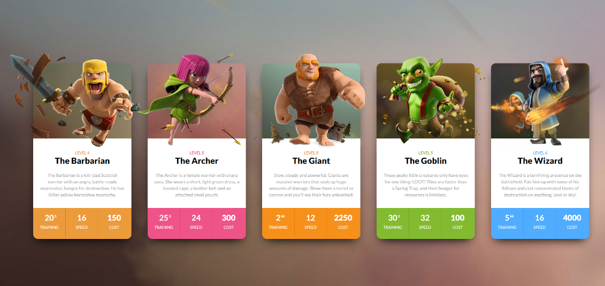

# Question 4
## Main Preview

# Task
## Change card stats background Color

// barbarian

let barbarian = document.querySelector(".clash-card__unit-stats--barbarian");
barbarian.style.background = "#ec9b3b";
barbarian.style.color = "#fff";

// changeing stats text color

let statColor = document.querySelectorAll("div .stat,.stat-value");
for (let i = 0; i < statColor.length; i++) {
  statColor[i].style.color = "#fff";
}

// archer
let archer = document.querySelector(".clash-card__unit-stats--archer");
archer.style.background = "#ee5487";

// giant
let giant = document.querySelector(".clash-card__unit-stats--giant");
giant.style.background = "#f6901a";

// goblin
let goblin = document.querySelector(".clash-card__unit-stats--goblin");
goblin.style.background = "#82bb30";

// wizard
let wizard = document.querySelector(".clash-card__unit-stats--wizard");
wizard.style.background = "#4facff";
